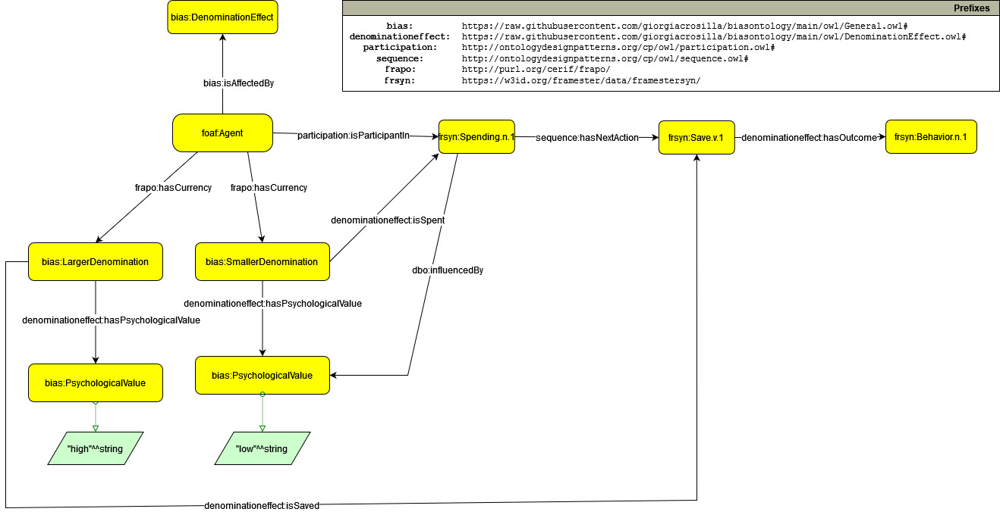

# Denomination effect



[Denomination Effect Bias OWL](https://github.com/giorgiacrosilla/biasontology/blob/main/owl/DenominationEffect.owl)

<figure><figcaption></figcaption></figure>

### <mark style="color:red;">C</mark>ontext literature and state of the art

According to Wikipedia, "The denomination effect is a form of cognitive bias relating to currency, suggesting people may be less likely to spend larger currency denominations than their equivalent value in smaller denominations. It was proposed by Priya Raghubir, professor at the New York University Stern School of Business, and Joydeep Srivastava, professor at University of Maryland, in their 2009 paper "Denomination Effect". 

Raghubir and Srivastava conducted three studies in their research on the denomination effect; their findings suggested people may be more likely to spend money represented by smaller denominations and that consumers may prefer to receive money in a large denomination when there is a need to control spending. The denomination effect can occur when large denominations are perceived as less exchangeable than smaller denominations."  

***

References:





***

### <mark style="color:red;">L</mark>LM

#### give me a definition of "denomination effect" 

As of my last knowledge update in January 2022, the term "denomination effect" may have various meanings depending on the context. However, one common interpretation is related to currency and how the denomination (the face value of a banknote or coin) can influence people's spending behavior. 

In the context of currency, the denomination effect refers to the psychological tendency of individuals to treat money differently based on its nominal value. For example, people might be more likely to spend smaller denominations more freely than larger ones, even if the overall value is the same. This effect can impact financial decision-making, budgeting, and saving habits. 

It's important to note that the term could be used in other fields or contexts, so the specific definition may vary depending on the subject matter. If there have been developments or changes in the use of the term since my last update, I recommend checking more recent sources for the latest information. 

#### Ok now give me 10 example scenarios of the denomination effect bias 

Certainly! Here are ten hypothetical scenarios illustrating the denomination effect bias: 

    Vending Machine Snack Choice: 

    Scenario: You have a $5 bill and a $1 bill. Despite having the same purchasing power, you choose to use the $1 bill for snacks from the vending machine, thinking it's more acceptable to spend smaller denominations casually. 

    Restaurant Tip Decision: 

    Scenario: After a meal, you contemplate leaving a tip. Even though the total bill is $20, you decide to leave a $5 bill as a tip instead of a single $20 bill, feeling more comfortable parting with the smaller denomination. 

    Charitable Donation Choice: 

    Scenario: You're considering making a donation to a charity. You find yourself more willing to donate five $1 bills rather than a single $5 bill, as it feels less impactful. 

    Cash Register Change Preference: 

    Scenario: You receive change for a $10 purchase, including a $5 bill and five $1 bills. You decide to spend the $1 bills first, holding onto the $5 bill for longer, as it seems like a larger sum. 

    Casual Spending with Coins: 

    Scenario: You have a handful of coins and a small bill. Instead of breaking the bill, you prefer to spend the coins first on small, impulsive purchases, considering them less valuable. 

    Budgeting with Large Bills: 

    Scenario: When budgeting for the week, you avoid breaking a $100 bill, even if smaller bills would be more practical. You perceive the larger denomination as more significant and hesitate to spend it on everyday expenses. 

    Saving Larger Bills: 

    Scenario: You receive a bonus in the form of a $50 bill and some $1 bills. While you're willing to spend the $1 bills, you decide to keep the $50 bill untouched, viewing it as savings for a more significant future expense. 

    Gift-Giving Decision: 

    Scenario: You're buying a gift for a friend with a budget of $20. Instead of using a single $20 bill, you opt to break it into smaller denominations, thinking it would make the gift seem more substantial. 

    Gambling Behavior: 

    Scenario: You visit a casino with $100 in your wallet. You find yourself more willing to spend smaller bills at the slot machines and save the $50 bill, considering it more valuable, even though the total amount is the same. 

    Petty Cash Preference: 

    Scenario: You manage a petty cash fund at work, which consists of various denominations. When making minor office purchases, you tend to use the smaller bills first, unconsciously preserving the larger bills for later use. 

These scenarios are designed to illustrate how the denomination effect bias might influence decision-making in various financial situations. 

#### Ok now consider the scenario "9. Gambling Behavior" and give me a small user story from it 

Emma, a casual gambler, decided to visit a local casino for an evening of entertainment. As she entered, she brought $100 in her wallet, consisting of a single $50 bill and several $1 bills. Excited to try her luck at the slot machines, Emma approached the first one she saw. 

She inserted a $1 bill into the slot and started spinning the reels. After a few rounds without a significant win, she contemplated her remaining funds. Despite the fact that the total amount in her wallet was still $100, Emma found herself hesitating to use the $50 bill. Instead, she continued to play with the $1 bills, thinking that the larger denomination was somehow more valuable. 

As she played, Emma mentally designated the $50 bill as a "reserve" for bigger opportunities or a potential lucky streak. This perception influenced her gambling behavior throughout the evening, and she ended up spending most of her time and smaller bills on the slot machines while preserving the $50 bill, showcasing the denomination effect bias in action during her casino experience.

#### We can now derive example-based-CQs from the user story.

1. What event does the agent participate in?

Spending 1 dollar bill.

```sparql

SELECT ?event
WHERE {
  ?event rdf:type event:Event .
  ?event participation:hasParticipant denominationeffect:Emma .
}
```

2. What denomination does the agent decide to spend and what to save?

Emma decides to spend the 1 dollar bill and save the 50 dollar bill.

```sparql

SELECT ?spendingDenomination ?savingDenomination
WHERE {
  :Spending1DollarBill rdf:type frsyn:Spending.n.1 ;
                        :isSpent ?spendingDenomination .
  :Saving50DollarBill rdf:type frsyn:Save.v.9 ;
                       :isSaved ?savingDenomination .
}
```

3. What element is the action of spending influenced by?

The action of spending is influenced by the psychological value of the 1 dollar bill.

```sparql
SELECT ?influence
WHERE {
  :Spending1DollarBill <http://dbpedia.org/ontology/influencedBy> ?influence .
}
```

#### Ok now if you should make an ontology of "denomination effect "bias what classes and properties would you create? 

Creating an ontology for the "Denomination Effect" bias involves defining classes and properties to represent key concepts and relationships within the domain. Below is a simplified ontology with some essential classes and properties: 

    Class: FinancialTransaction 

    Represents a financial transaction involving the exchange of money. 

    Class: CurrencyDenomination 

    Represents different monetary denominations (e.g., $1 bill, $5 bill, etc.). 

    Class: DecisionMaker 

    Represents an individual making decisions related to financial transactions. 

    Property: involvesTransaction 

    Relates a DecisionMaker to a FinancialTransaction. 

    Property: usesDenomination 

    Relates a FinancialTransaction to a CurrencyDenomination, indicating the denominations involved in the transaction. 

    Class: SpendingBehavior 

    Represents the overall behavior of a DecisionMaker when spending money. 

    Property: influencedByDenominationEffect 

    Relates SpendingBehavior to CurrencyDenomination, indicating the influence of the denomination effect on spending decisions. 

    Class: PsychologicalImpact 

    Represents the psychological impact of monetary denominations on decision-making. 

    Property: perceivedValue 

    Relates PsychologicalImpact to CurrencyDenomination, representing how individuals perceive the value of different denominations. 

    Class: MoneyManagementStrategy 

    Represents a strategy employed by a DecisionMaker to manage their money. 

    Property: reserveStrategy 

    Relates MoneyManagementStrategy to CurrencyDenomination, indicating the strategy of reserving certain denominations for specific purposes. 

This ontology provides a basic structure to represent the key components and relationships associated with the denomination effect bias in the context of financial transactions and decision-making. Depending on the depth and specificity needed for a particular application or analysis, additional classes and properties may be defined. 

#### Framester frames used:

* [Behavior (subclass of Conduct)](https://w3id.org/framester/data/framestercore/Certainty](https://w3id.org/framester/data/framestersyn/Behavior.n.1 )
* [Save (subclass of CommercePay)](https://w3id.org/framester/data/framestercore/SubjectiveInfluence](https://w3id.org/framester/data/framestersyn/Save.v.9 )
* [Spending (subclass of CommercePay)](https://w3id.org/framester/data/framestersyn/Spending.n.1)

#### ODP used:

* [Sequence](http://ontologydesignpatterns.org/cp/owl/sequence.owl)
* [Participation](http://ontologydesignpatterns.org/cp/owl/participation.owl)
