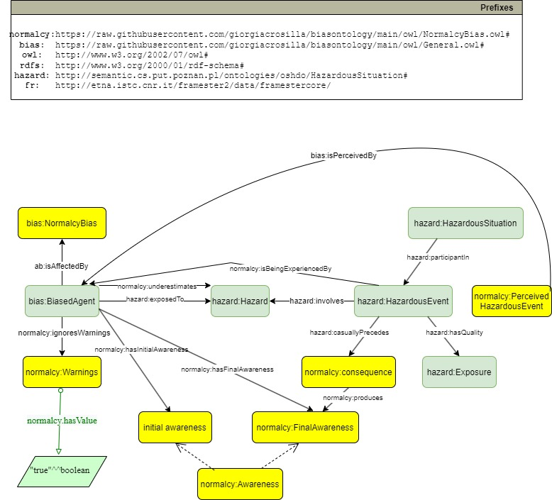

# 😳 Normalcy Bias



[Normalcy Bias OWL](https://raw.githubusercontent.com/giorgiacrosilla/biasontology/main/owl/NormalcyBias.owl)

<figure><figcaption></figcaption></figure>

According to the definition provided on Wikipedia: “Normalcy bias, or normality bias, is a cognitive bias which leads people to disbelieve or minimize threat warnings”. The bias is manifested in cases of incoming natural disasters or calamities caused by human error where it’s estimated that about 70% of the population tends to minimize threats and so to display this bias.

People’s behaviour tends to be believing the less alarming option when in danger and this belief remains still until confirmation from other sources or unambiguous instructions are given. This bias can lead to a lack of preparedness, inadequate response to warnings, and a false sense of security, ultimately resulting in serious consequences.

Abnormalcy bias and normalcy bias can often be noticed in conjunction when authorities decide not to say everything, they know about the danger both because they mistakenly think the threat is unlikely and believe that even if it does happen, people wouldn't be able to use the information to cope effectively (Omer 1994).

<figure><figcaption><p>Image taken from Murata, Atsuo, Tomoko Nakamura, and Waldemar Karwowski. 2015. Influence of Cognitive Biases in Distorting Decision Making and Leading to Critical Unfavorable Incidents, Safety 1, no. 1: 44-58. https://doi.org/10.3390/safety1010044</p></figcaption></figure>

***

References:

Omer H. and Alon N., The Continuity Principle: A Unified Approach to Disaster and Trauma, American Journal of Community Psychology, Vol. 22, No. 2, 1994.

Nikolopoulou, K. (2023, April 6). What is normalcy bias? | Definition & example. Scribbr. https://www.scribbr.com/research-bias/normalcy-bias/

Murata, Atsuo, Tomoko Nakamura, and Waldemar Karwowski. 2015. Influence of Cognitive Biases in Distorting Decision Making and Leading to Critical Unfavorable Incidents, Safety 1, no. 1: 44-58. https://doi.org/10.3390/safety1010044

***

### <mark style="color:red;">L</mark>LM

#### Can you give me a definition of "Normalcy Bias"?

The appeal to probability fallacy, also known as the argument from probability, occurs when someone argues that because something is likely to happen, it is therefore true or should be believed. This fallacy disregards evidence or logical reasoning and relies on the probability of an event occurring rather than on conclusive support. The mere likelihood of an outcome does not necessarily make it true, and conclusions drawn solely from probability without proper evidence can be misleading. In critical thinking and argumentation, it is essential to consider both the probability of an event and the available evidence to make a valid and well-supported conclusion.

#### Can you create 10 scenarios compelling with the bias?

3\. Health Pandemics:

During the early stages of a global health crisis, some people may downplay the severity of the situation, assuming that the impact of a pandemic will be limited or that it won't reach their community.

#### Now consider the scenario "Health Pandemics" and give me a short user story from it.

User Story: A Lesson in Normalcy Bias during a Health Pandemic

Once upon a time, in a city called Serenityville, Sarah, a 32-year-old office worker, found herself caught in the midst of a rapidly spreading health pandemic.

Sarah had always enjoyed the calm and routine of her daily life. She had heard about outbreaks in distant parts of the world but never truly believed that such a crisis could touch her peaceful community. The local news began reporting on the severity of the situation, with experts urging citizens to take precautionary measures.

However, Sarah, influenced by her normalcy bias, couldn't fathom the idea that her city might be significantly affected. She continued her routine, socializing freely, and neglecting the recommended safety precautions. Her friends, aware of the seriousness of the situation, tried to warn her, but Sarah reassured herself that her city was an exception.

As the pandemic intensified, Sarah's workplace implemented remote work policies, and public spaces began shutting down. Yet, Sarah clung to the belief that things would return to normal soon. She dismissed the possibility of a lockdown affecting her life, assuming that her community would remain untouched.

It wasn't until Sarah's own health was compromised that she began to acknowledge the reality of the situation. She tested positive for the virus, experiencing firsthand the consequences of underestimating the pandemic's impact. Fortunately, she recovered, but the experience served as a stark reminder of the dangers of normalcy bias.

In the aftermath, Sarah became an advocate for public health awareness, sharing her story to encourage others to overcome their normalcy bias, stay informed, and take necessary precautions in the face of unforeseen health crises.

#### We can now derive example-based-CQs from the user story.

1. Did Sarah ignore warnings when outbreaks of pandemic started to come out?

True.

```sparql
select ?warnings where {
		?Event normalcy:isBeingExperiencedBy ?Agent . 
		?Agent normalcy:ignoresWarnings ?Warning .
		?Warning normalcy:hasParameterDataValue ?warnings . }

```

2. Was Sarah aware of the problems that the pandemic would cause to her city?

No, because she was convinced that her city would never be affected by a lockdown.

```sparql
select ?awareness where {
		?Event normalcy:isBeingExperiencedBy ?Agent .
		?Agent normalcy:hasInitialAwareness ?awareness .}
```

3. What is Sarah's awareness after contracting the virus?

Sarah understands the reality of the situation and the danger of the virus.

```sparql
select ?final where {
		?Agent hazard:exposedTo ?Hazard .
		?Hazard hazard:isInvolvedIn ?Event .
		?Event hazard:casuallyPrecedes ?Consequence .
		?Consequence normalcy:produces ?final .}
```

#### If you should make an ontology based of the "Normalcy Bias" which classes and properties would you create?

Classes:

1\. Individual:

\- Represents a person or an entity susceptible to normalcy bias.

2\. Event:

\- Represents a potential disruptive event or crisis that individuals may underestimate.

3\. Awareness Level:

\- Represents the cognitive state of an individual regarding their awareness of potential risks.

Properties:

1\. hasNormalcyBias:

\- Connects an Individual to their tendency to exhibit normalcy bias.

2\. underestimates:

\- Relates an Individual to an Event, indicating that the individual underestimates the severity or likelihood of the event.

3\. ignoresWarnings:

\- Connects an Individual to signals or warnings related to a potential crisis that they tend to ignore.

4\. clingsToRoutine:

\- Relates an Individual to their adherence to routine and reluctance to consider deviations from the norm.

5\. experiencesEvent:

\- Connects an Individual to an Event, representing the occurrence of a crisis or disruptive event.

6\. hasAwarenessLevel:

\- Connects an Individual to their cognitive state, indicating the level of awareness regarding potential risks.

### ODP used:

* [HazardousSituation](http://ontologydesignpatterns.org/wiki/Submissions:HazardousSituation)

