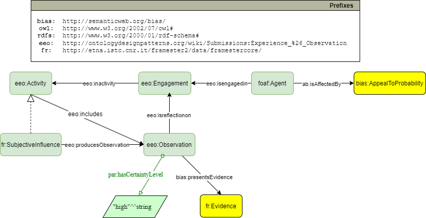

# 😳 Normalcy Bias



<figure><figcaption></figcaption></figure>

P1: X is possible.

P2: (unstated) Anything which is possible, is certain.

C: X is certain.

The fallaciousness of this line of logic should be apparent from the second, unstated premise (P2), which is logically inconsistent.

An example of Appeal to probability fallacy is the Murphy’s law.

***

References:





***

### <mark style="color:red;">L</mark>LM

#### Can you give me a definition of "appeal to probability fallacy"?

The appeal to probability fallacy, also known as the argument from probability, occurs when someone argues that because something is likely to happen, it is therefore true or should be believed. This fallacy disregards evidence or logical reasoning and relies on the probability of an event occurring rather than on conclusive support. The mere likelihood of an outcome does not necessarily make it true, and conclusions drawn solely from probability without proper evidence can be misleading. In critical thinking and argumentation, it is essential to consider both the probability of an event and the available evidence to make a valid and well-supported conclusion.

#### Can you create 10 scenarios compelling with the bias?

6\. \*\*Climate Change Denial:\*\*

\*Claim:\* "We don't need to address climate change because scientists can't prove with 100% certainty that human activity is the sole cause."

\*Fallacy:\* Demanding absolute certainty and using the absence of complete proof as justification for inaction.

#### Now consider the scenario "climate change denial" and give me a short user story from it.

\*\*User Story: Climate Change Denial\*\*

\*\*User:\*\* Emily, a concerned citizen and environmental advocate.

\*\*Scenario:\*\*

Emily is passionate about addressing climate change and its potential impact on the planet. She engages in discussions with her friend Alex, who is skeptical about the severity of climate change. Alex argues that there's still uncertainty among scientists and points out instances where climate predictions were inaccurate.

\*\*Conversation:\*\*

\*Emily:\* "Alex, I really think we need to take climate change seriously. The scientific consensus is strong, and the consequences could be devastating."

\*Alex:\* "I'm not convinced. Scientists have been wrong before, and there's still uncertainty about the causes and the extent of climate change."

\*Emily:\* "True, science isn't always perfect, but the overwhelming majority of climate scientists agree that human activities are causing global warming. We shouldn't ignore the risks."

\*Alex:\* "I just think it's a natural cycle, and we shouldn't make drastic changes based on incomplete information."

\*Emily:\* "It's not incomplete information; it's a consensus backed by extensive research. Waiting for 100% certainty could lead to irreversible damage. We need to act now to mitigate the impacts."

\*Alex:\* "But what if we spend trillions on measures that turn out to be unnecessary? I'd rather wait until we're absolutely sure."

\*Emily:\* "That's the appeal to probability fallacy, Alex. We can't wait for absolute certainty. The potential risks are too great. It's like refusing to evacuate during a hurricane because the forecast isn't 100% certain. We should prioritize the precautionary principle and take action before it's too late."

#### If you should make an ontology based of the "appeal to probability fallacy" which classes and properties would you create?

Classes:

1\. \*\*Fallacy:\*\*

\- \*Description:\* Represents the overarching concept of a logical fallacy.

2\. \*\*AppealToProbabilityFallacy:\*\*

\- \*Subclass of:\* Fallacy

\- \*Description:\* Represents the specific fallacy where a conclusion is asserted to be likely true based on probabilities.

3\. \*\*Claim:\*\*

\- \*Description:\* Represents a statement or proposition that is made as part of an argument.

4\. \*\*Evidence:\*\*

\- \*Description:\* Represents information or data presented in support of a claim.

5\. \*\*Certainty:\*\*

\- \*Description:\* Represents the level of certainty associated with a claim or argument.

Properties:

1\. \*\*hasFallacyType:\*\*

\- \*Domain:\* Fallacy

\- \*Range:\* xsd:string

\- \*Description:\* Indicates the type of fallacy, such as "Appeal to Probability Fallacy."

2\. \*\*assertsClaim:\*\*

\- \*Domain:\* Fallacy

\- \*Range:\* Claim

\- \*Description:\* Indicates the claim associated with the fallacious argument.

3\. \*\*presentsEvidence:\*\*

\- \*Domain:\* Claim

\- \*Range:\* Evidence

\- \*Description:\* Links a claim to the evidence presented in support of that claim.

4\. \*\*hasCertaintyLevel:\*\*

\- \*Domain:\* Claim

\- \*Range:\* Certainty

\- \*Description:\* Represents the level of certainty associated with a claim.

5\. \*\*isBasedOnProbability:\*\*

\- \*Domain:\* AppealToProbabilityFallacy

\- \*Range:\* Claim

\- \*Description:\* Indicates that the fallacy involves basing a conclusion on probabilities rather than solid evidence.

\### Example Instance:

Let's consider an instance to illustrate the ontology:

\- \*\*Instance: ProbabilityDenialArgument\*\*

\- \*Type:\* AppealToProbabilityFallacy

\- \*hasFallacyType:\* "Appeal to Probability Fallacy"

\- \*assertsClaim:\* "Climate change is not a significant threat because there's a chance the models are incorrect."

\- \*presentsEvidence:\* "Historical climate predictions that were inaccurate."

\- \*hasCertaintyLevel:\* "Low"

\- \*isBasedOnProbability:\* "Climate change denial argument relies on the possibility of models being incorrect."

### Framester Frames used:

*

<!---->

* [Evidence](https://w3id.org/framester/data/framestercore/Evidence)

### ODP used:

* .....
