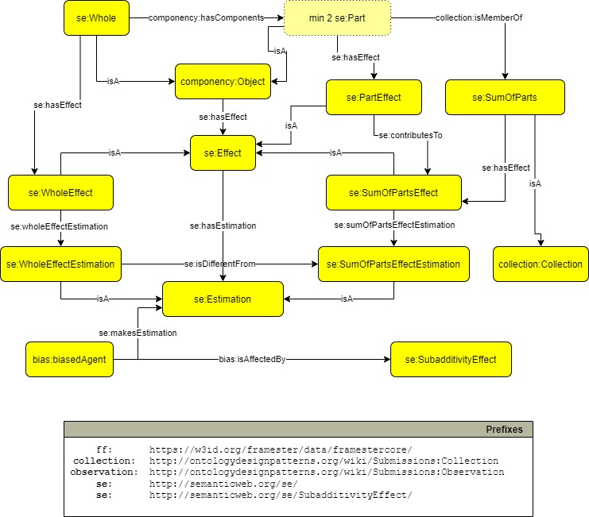

# Subadditivity effect



<figure><figcaption></figcaption></figure>

### Context literature and state of the art
The **subadditivity effect** is the tendency to judge probability of the whole to be less than the probabilities of the parts. 

In a 2012 article in *Psychological Bulletin* it is suggested the subadditivity effect can be explained by an information-theoretic generative mechanism that assumes a noisy conversion of objective evidence (observation) into subjective estimates (judgment). This explanation is different than support theory, proposed as an explanation by Tversky and Koehler, which requires additional assumptions. 

***

References:





***

# Large Language Model

#### Can you give me a definition of "Subbaditivity effect"?

The Subadditivity Effect refers to a phenomenon in decision-making or perception where the combination of multiple components or factors produces a smaller total effect than the sum of their individual effects. In other words, when people assess the combined value or magnitude of multiple items or attributes, they tend to underestimate it compared to the sum of their individual values. This effect is often observed in various domains such as economics, psychology, and neuroscience, and it can have implications for understanding human judgment and behavior. 

#### Can you create 10 scenarios compelling with the bias?

The Subadditivity Effect refers to situations where the combined value or effect of multiple components is smaller than the sum of their individual values. Here are ten example scenarios illustrating the Subadditivity Effect: 

1. **Team Projects**: In a group project, each member's individual effort may contribute positively to the overall outcome. However, due to coordination challenges or duplication of work, the collective effort of the team may not be as substantial as the sum of each member's individual contributions. 

2. **Company Mergers**: Two companies merge with the expectation that the combined entity will generate more profit than the sum of their individual profits. However, due to integration challenges, overlapping functions, and cultural differences, the merged company's profitability may be lower than anticipated. 

3. **Environmental Impact**: Multiple pollutants released into the environment may have individual effects on ecosystems. However, when these pollutants interact, their combined impact on biodiversity, water quality, or air quality may be greater than the sum of their individual effects.

4. **Marketing Campaigns**: A company launches multiple marketing campaigns simultaneously, each aimed at increasing brand awareness or sales. However, consumers may experience cognitive overload or confusion, leading to a subadditive effect where the overall impact of the campaigns is less than the sum of their individual impacts. 

5. **Healthcare Costs**: Treating multiple medical conditions simultaneously may require various medications, treatments, and healthcare resources. However, managing these conditions together may lead to cost savings compared to treating them separately due to shared resources or streamlined care. 

6. **Investment Diversification**: Investors diversify their portfolios by allocating funds across multiple asset classes to reduce risk. However, if the correlation between these assets is high, the diversification benefit may be lower than expected, resulting in a subadditive effect on portfolio risk reduction.   

7. **Product Bundling**: A company offers a bundled package of products or services at a discounted price compared to purchasing each item individually. However, if consumers value each item differently or have varying preferences, the perceived value of the bundle may be lower than the sum of the individual items' values. 

8. **Public Infrastructure Projects**: Governments invest in multiple infrastructure projects, such as roads, bridges, and public transportation systems, to improve overall societal well-being. However, if these projects are not integrated or coordinated effectively, the combined benefit to society may be lower than the sum of the benefits of each project. 

9. **Educational Programs**: A school district implements various educational programs aimed at improving student outcomes, such as literacy programs, STEM initiatives, and extracurricular activities. However, if these programs overlap or compete for resources, the overall impact on student achievement may be less than the sum of the impacts of each program. 

10. **Supply Chain Management**: Companies source raw materials, components, and finished goods from multiple suppliers to mitigate supply chain risks. However, disruptions at one supplier may cascade through the entire supply chain, leading to production delays or shortages that have a greater impact than if each supplier were managed independently. 

***We can notice that the scenarios offer cases in which the sum of parts is actually smaller in its effects than whole effects***

#### Now consider the scenario "Team Projects" and give me a short user story from it.

User Story: As a project manager overseeing a team project, I want to ensure that the combined efforts of all team members result in a successful outcome that meets our project goals, so that we can deliver high-quality work efficiently. 

Acceptance Criteria: 

1. Define clear project objectives, milestones, and roles for each team member to ensure alignment and accountability. 

2. Conduct regular team meetings to discuss progress, identify potential challenges, and adjust strategies as needed to keep the project on track. 

3. Encourage open communication and collaboration among team members to leverage individual strengths and address any conflicts or inefficiencies promptly. 

4. Implement project management tools or software to facilitate task assignment, tracking, and documentation, enabling transparency and accountability throughout the project lifecycle. 

5. Provide opportunities for team members to provide feedback, share insights, and propose improvements to enhance overall productivity and effectiveness. 

6. Monitor key performance indicators (KPIs) such as project timelines, budget utilization, and quality metrics to assess progress and identify areas for optimization. 

7. Foster a positive team culture that values diversity, creativity, and continuous learning, promoting motivation and engagement among team members. 

8. Celebrate milestones and achievements to recognize the collective efforts of the team and maintain morale and motivation throughout the project duration. 

9. Proactively address any resource constraints, technical challenges, or external dependencies that may impact the project timeline or deliverables, seeking solutions collaboratively with relevant stakeholders. 

10. Conduct a comprehensive project review upon completion to evaluate successes, lessons learned, and areas for improvement, informing future project planning and execution.

***As can be noticed, the LLM mistaken the task required.***

#### We can now derive example-based-CQs from the user story.&#x20;
1. Which are the parts of the team?
   * Member1, Member2, ...

  ```sparql
SELECT ?member WHERE { 
?whole componency:hasComponent ?member. 
} 
```

3. What is the Effect of the Team as a whole?
  * Team Effect

```sparql
SELECT ?effect WHERE { 
?team componency:hasComponent subadditivityeffect:Member1. 
?team subadditivityeffect:hasEffect ?effect. 
} 
```

3. What is the effect of Member1?
  * Member1 Effort

```sparql
SELECT ?sum WHERE { 

 subadditivityeffect:ActualTime subadditivityeffect:isDifferentFrom ?sumEstimation. 
?sumEffect subadditivityeffect:hasEffect ?sumEstimation. 
?sum subadditivityeffect:hasEffect ?sumEffect. 
} 
```


#### If you should make an ontology based of the "appeal to probability fallacy" which classes and properties would you create?

Creating an ontology for the Subadditivity Effect involves defining classes to represent various entities and properties to describe their relationships and attributes. Here's a simplified ontology for the Subadditivity Effect: 

Classes: 

1. **Phenomenon**: Represents the Subadditivity Effect as a psychological or cognitive phenomenon. 

2. **Factors**: Represents the individual components or factors contributing to a situation where the Subadditivity Effect occurs. 

3. **Combined Effect**: Represents the result or outcome when multiple factors are combined, demonstrating the Subadditivity Effect. 

4. **Individual Effect**: Represents the separate impact or value of each factor before they are combined. 

Properties: 

1. **hasFactors**: Relates a Phenomenon to the individual Factors contributing to it. 

2. **hasCombinedEffect**: Relates a Phenomenon to the Combined Effect observed when Factors are combined. 

3. **hasIndividualEffect**: Relates a Phenomenon to the Individual Effect of each Factor before combination. 

4. **isObservedIn**: Relates a Phenomenon to specific scenarios or domains where the Subadditivity Effect is observed. 

5. **isAffectedBy**: Relates Factors to external influences or conditions that may affect the occurrence or magnitude of the Subadditivity Effect. 

6. **hasMagnitude**: Describes the extent or degree of the Subadditivity Effect observed in a particular scenario. 

7. **hasContext**: Describes the context or conditions under which the Subadditivity Effect occurs, such as decision-making, perception, or cognition. 

This ontology provides a framework for representing and analyzing instances of the Subadditivity Effect across various contexts and scenarios.


### Framester used

### ODP used
* [Collection](http://www.ontologydesignpatterns.org/cp/owl/collectionentity.owl)
* [Observation](http://www.ontologydesignpatterns.org/cp/owl/observation.owl)
