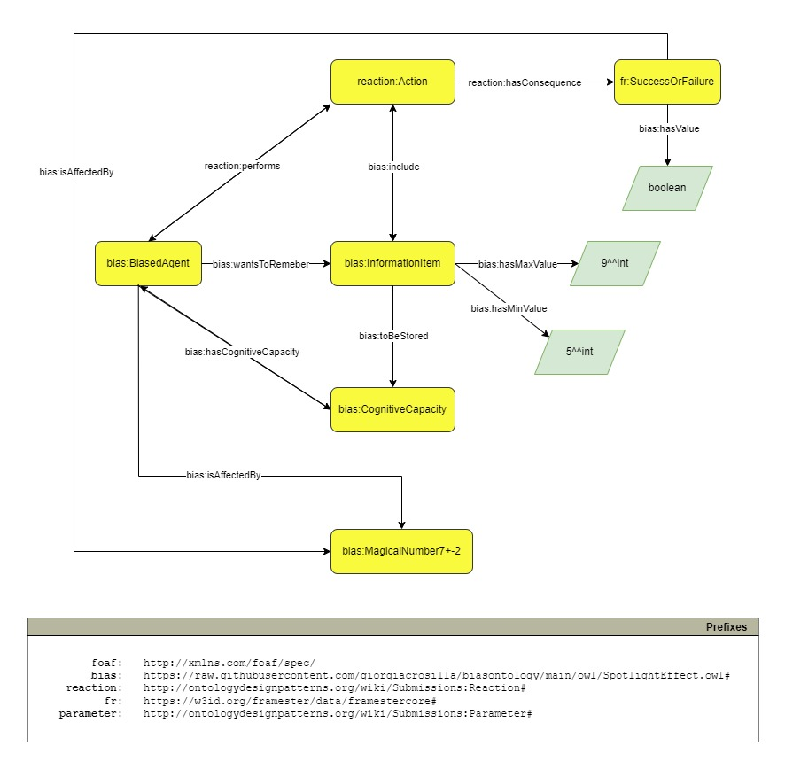

# 7️⃣ The magical number 7+-2



[The Magical Number OWL](https://raw.githubusercontent.com/giorgiacrosilla/biasontology/main/owl/TheMagicalNumber.owl)

<figure><figcaption></figcaption></figure>

***

References:







***

### <mark style="color:red;">L</mark>LM

#### Can you give me a definition of "The magical number 7+-2" bias?

The Magical Number Seven, Plus or Minus Two" bias refers to the cognitive bias related to the limitations of human short-term memory capacity. Coined by psychologist George A. Miller in 1956, it suggests that the average person can hold approximately seven (plus or minus two) pieces of information in their short-term memory at any given time. This bias implies that individuals may have difficulty processing and remembering information beyond this capacity, leading to errors in judgment, decision-making, and information retention. It highlights the constraints of human cognition and the importance of considering these limitations in various cognitive tasks, such as learning, problem-solving, and communication.

#### Can you create 10 scenarios compelling with the bias?

*1.* Phone Numbers: When trying to remember a new phone number, individuals may find it challenging to retain all the digits at once, especially if the number is long. This can result in errors or the need to repeat the number multiple times to remember it accurately.

*2.* PIN Codes: People may struggle to remember PIN codes for various accounts, such as ATM cards or mobile devices, particularly if they are not frequently used. This can lead to forgetting the code or inputting the wrong one multiple times before recalling it correctly.

*3.* Shopping Lists: When tasked with remembering a list of items to buy at the grocery store, individuals may find it difficult to retain more than seven items in their short-term memory. This can result in forgetting some items or needing to write the list down to avoid missing anything.

*4.* Meeting Agendas: In a business setting, participants in a meeting may struggle to recall all the agenda items discussed, especially if there are numerous topics covered. This can lead to incomplete or inaccurate recollections of the meeting's content.

*5.* Test Questions: Students may experience difficulty remembering all the information needed to answer exam questions, particularly in subjects with complex concepts or extensive material. This can result in incomplete or partially correct responses due to exceeding the capacity of short-term memory.

*6.* Instructions with Multiple Steps: When given a series of instructions involving several steps, individuals may have trouble remembering all the steps without repetition or written documentation. This can lead to errors in completing tasks or omitting essential steps.

*7.* Password Management: Individuals managing multiple passwords for various online accounts may struggle to recall them all accurately, especially if the passwords are complex or changed frequently. This can result in forgotten passwords or the need for password recovery assistance.

*8.* Presentation Content: Speakers delivering presentations may find it challenging to remember all the points they intend to cover without referring to notes or slides. This can lead to omissions or disorganized delivery as they exceed their short-term memory capacity.

*9.* Directions: When given verbal directions to navigate to a specific location, individuals may have difficulty retaining all the details, especially if there are numerous turns or landmarks mentioned. This can result in getting lost or needing to ask for clarification along the way.

*10.* Remembering Names: When meeting new people in social or professional settings, individuals may struggle to remember everyone's names, particularly in larger groups. This can lead to awkward interactions or the need to ask for names to be repeated multiple times.

#### Now consider the scenario "shopping list" and give me a short user story from it.

\*\*Scenario:\*\*

As a busy parent, I want to create a shopping list for groceries so that I can efficiently gather all the necessary items for the week without forgetting anything. However, I often find myself struggling to remember all the items needed, especially when the list grows beyond a certain number. I need a solution that helps me organize and remember the items on my list, ensuring a smooth and stress-free shopping experience.

#### We can now derive example-based-CQs from the user story.&#x20;

1. Who is the Biased Agent and what is the action he/she/it is trying to perform while effected by the bias?&#x20;

- &#x20;       Biased Agent and Action.&#x20;
- &#x20;       Busy Parent and Create Shopping List.&#x20;

```sparql
SELECT ?BiasedAgent ?Action
WHERE {
    ?BiasedAgent reaction:performs ?Action.
}
```

2. What is the Information Item that the Biased Agent is trying to memorize? And what Minimum and Maximum values does it have?&#x20;

- &#x20;       Information Item & Max & Min.&#x20;
- &#x20;       List Item & 9 & 5.&#x20;

```sparql
SELECT ?InformationItem ?Max ?Min
WHERE {
    ?InformationItem magicalnumber:hasMaxValue ?Max .
    ?InformationItem magicalnumber:hasMinValue ?Min .
}
```

3. What Outcome can the Action have? What are the possible values of this outcome?&#x20;

- &#x20;       Outcome & Value.&#x20;
- &#x20;       Memorize or Not & Boolean: True or False.&#x20;

```sparql
SELECT ?Outcome ?Value
WHERE {
    ?Action reaction:hasConsequence ?Outcome .
    ?Outcome magicalnumber:hasValue ?Value . 
}
```

#### If you should make an ontology based of the "curse of knowledge" which classes and properties would you create?

\#Classes:

-CognitiveCapacity: Represents the cognitive capacity of an individual's short-term memory.

-InformationItem: Represents individual pieces of information to be stored in short-term memory.

-CognitiveTask: Represents tasks or activities that require the use of short-term memory.

-Error: Represents instances where cognitive limitations lead to mistakes or inaccuracies.

\#Properties:

-hasCapacity: Describes the maximum number of information items that can be held in short-term memory.

-includesItem: Specifies the information items included in a cognitive task.

-resultsInError: Indicates instances where cognitive limitations result in errors in completing a task.

-relatesToTask: Relates cognitive capacity to specific cognitive tasks.

Example ontology instance:

CognitiveCapacity:

hasCapacity: 7 (plus or minus 2)

InformationItem:

Text: "Phone number"

Text: "PIN code"

Text: "Shopping list item"

CognitiveTask:

includesItem: "Phone number"

includesItem: "PIN code"

includesItem: "Shopping list item"

resultsInError: Forgetting shopping list items

Error:

relatesToTask: Forgetting shopping list items

### Framester Frames used:

- [SuccessOrFailure](https://w3id.org/framester/data/framestercore/SuccessOrFailure)

### ODP used:
- [Reaction](http://ontologydesignpatterns.org/wiki/Submissions:Reaction#)
- [Parameter](http://ontologydesignpatterns.org/wiki/Submissions:Parameter#)

