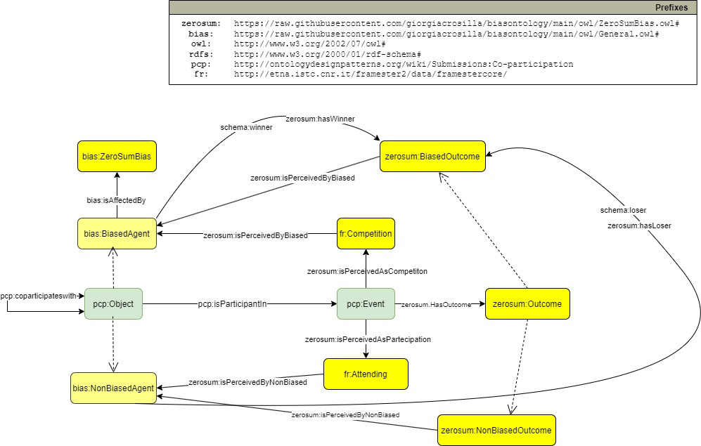

# 😏 Zero-sum bias



<figure><figcaption></figcaption></figure>

### <mark style="color:red;">C</mark>ontext literature and state of the art

According to the definition provided on Wikipedia: “Zero-sum thinking perceives situations as zero-sum games, where one person's gain would be another's loss”. When individuals think that a situation is zero-sum, they will be more likely to act competitively towards others, because they will see others as a competitive threat.

From the experiments undertaken by Meegan in 2010, it appeared that people are prone to perceive a competition for limited resources even when there are unlimited resources available. The same author finds this behaviour as a legacy coming from competition inside a group of people when resources were not guaranteed for all of them.

This bias can lead to envy and a tendency toward unhealthy competition among individuals.

***

References:



Meegan DV. Zero-sum bias: perceived competition despite unlimited resources. Front Psychol. 2010 Nov 5;1:191. doi: 10.3389/fpsyg.2010.00191. PMID: 21833251; PMCID: PMC3153800. URL:

https://www.ncbi.nlm.nih.gov/pmc/articles/PMC3153800/ .

***

### <mark style="color:red;">L</mark>LM

#### Can you give me a definition of "appeal to probability fallacy"?

The appeal to probability fallacy, also known as the argument from probability, occurs when someone argues that because something is likely to happen, it is therefore true or should be believed. This fallacy disregards evidence or logical reasoning and relies on the probability of an event occurring rather than on conclusive support. The mere likelihood of an outcome does not necessarily make it true, and conclusions drawn solely from probability without proper evidence can be misleading. In critical thinking and argumentation, it is essential to consider both the probability of an event and the available evidence to make a valid and well-supported conclusion.

#### Can you create 10 scenarios compelling with the bias?

Competition in Academics: Believing that if one student excels in a class, it automatically means that other students will perform poorly, rather than recognizing the potential for collective improvement.

#### Now consider the scenario "Competition in academics" and give me a short user story from it.

User Story: "Academic Competition Perspective Shift"&#x20;

Sarah, a diligent high school student, had always approached her studies with a competitive mindset. She constantly compared her grades to those of her classmates, believing that academic success was a zero-sum game. If someone else scored well, she felt that it somehow diminished her own achievements.&#x20;

One day, the school announced a prestigious academic competition where students could showcase their research projects. Sarah, determined to outshine her peers, worked tirelessly on her project, fueled by the zero-sum bias that winning the competition meant others would inevitably lose.&#x20;

As the competition day approached, Sarah found herself immersed in the diverse projects of her classmates during a pre-competition showcase. Surprisingly, instead of feeling threatened, she began to appreciate the unique talents and perspectives each project brought to the table.&#x20;

During the competition, Sarah presented her research passionately but now with a newfound appreciation for the variety of subjects her classmates explored. When the results were announced, she was pleasantly surprised to win second place. However, the true transformation happened when she realized that her success didn't diminish the accomplishments of her peers.&#x20;

This experience prompted Sarah to reconsider her zero-sum bias in academics. She started collaborating with classmates, sharing knowledge, and celebrating each other's successes. In doing so, she not only fostered a more positive academic environment but also discovered the joy of learning and growing collectively.&#x20;

#### We can now derive example-based-CQs from the user story.

1. How did Sarah approach her studies?&#x20;

&#x20;       As a competition. &#x20;

```sparql
select ?perception where {
		?Agent pcp:isParticipantIn ?Event .
		?Event zerosum:isPerceivedAsCompetition ?perception . }
```

2. Who are the winners and the losers of the competition?&#x20;

&#x20;       Sarah is the winner and the classmates are losers.  &#x20;

```sparql
select ?loser ?winner where {
		?Agent zerosum:isPerceivingBiased ?BiasedOutcome . 
		?BiasedOutcome zerosum:hasLoser ?loser .
		?BiasedOutcome zerosum:hasWinner ?winner . }
```

3. How is the test perceived by the classmates instead?&#x20;

&#x20;       As only a test, not a competition with winners and losers. &#x20;

```sparql
select ?test where {
	?Agent pcp:isParticipantIn ?Event . 
	?Event zerosum:isPerceivedAsParticipation ?test . }
```

#### If you should make an ontology based of the "Zero Sum Bias" which classes and properties would you create?

* Class: CognitiveBias&#x20;

Properties:&#x20;

Definition: A mental inclination or pattern of thought leading to systematic deviations from norm or rationality.&#x20;

Subclass of: MentalState&#x20;

* Class: ZeroSumBias&#x20;

Properties:&#x20;

Definition: A specific cognitive bias where individuals perceive situations as zero-sum games, believing that one party's gain results in an equivalent loss for others.&#x20;

Subclass of: CognitiveBias&#x20;

* Class: PerceivedCompetition&#x20;

Properties:&#x20;

Definition: The subjective belief that success or gain in a given context is inherently competitive and comes at the expense of others.&#x20;

Subclass of: CognitiveAspect&#x20;

* Class: FixedResourceMindset&#x20;

Properties:&#x20;

Definition: The tendency to view resources or opportunities as fixed and limited rather than dynamic and expandable.&#x20;

Subclass of: CognitiveAspect&#x20;

* Class: CompetitiveScenario&#x20;

Properties:&#x20;

Definition: A situation where individuals are inclined to apply zero-sum thinking, often hindering collaboration and mutual benefit.&#x20;

Subclass of: SocialContext&#x20;

* Class: CollaborativePotential&#x20;

Properties:&#x20;

Definition: The recognition that, despite initial perceptions, many situations have the potential for collaboration and mutual benefit.&#x20;

Subclass of: CognitiveAspect&#x20;

* Class: PositiveMindsetTransformation&#x20;

Properties:&#x20;

Definition: The process of shifting from a zero-sum bias to a mindset that embraces collaboration, shared success, and positive interactions.&#x20;

Subclass of: CognitiveTransformation&#x20;

* Class: ExampleScenario&#x20;

Properties:&#x20;

Definition: Instances or situations illustrating the manifestation of zero-sum bias in various contexts.&#x20;

Subclass of: CognitiveAspect&#x20;

* Class: BiasMitigationStrategies&#x20;

Properties:&#x20;

Definition: Strategies or interventions aimed at mitigating the effects of zero-sum bias and promoting a more cooperative mindset.&#x20;

Subclass of: CognitiveIntervention&#x20;

### Framester Frames used:

* [Competition](https://w3id.org/framester/data/framestercore/Competition)
* [Attending](https://w3id.org/framester/data/framestercore/Attending)

### ODP used:

* [Co-participation](http://ontologydesignpatterns.org/wiki/Submissions:Co-participation)
