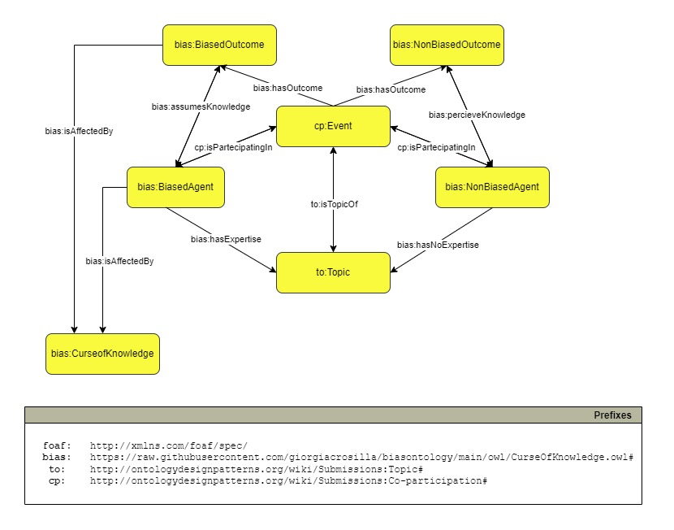

# 🤓 Curse of knowledge



[Curse Of Knowledge OWL](https://raw.githubusercontent.com/giorgiacrosilla/biasontology/main/owl/CurseOfKnowledge.owl)

<figure><figcaption></figcaption></figure>


***

References:







***

### <mark style="color:red;">L</mark>LM

#### Can you give me a definition of "Curse of knowledge" bias?

The "curse of knowledge" bias refers to a cognitive phenomenon in which individuals who possess a particular piece of information or expertise find it challenging to understand or communicate with others who lack that same knowledge. This bias can lead to the knowledgeable person assuming that others have a similar level of understanding, which may result in ineffective communication or difficulty in conveying ideas to those with less expertise. Essentially, the curse of knowledge bias impedes effective communication by creating a gap between what one knows and what others may comprehend, often leading to misunderstandings or misinterpretations. 

#### Can you create 10 scenarios compelling with the bias?

*1.* Technical Jargon in Presentations: A software developer giving a presentation to a non-technical audience uses complex coding terms without explaining them, assuming everyone understands the terminology. 

*2.* Expert Teaching Beginners: A seasoned chef instructing a cooking class for beginners may unintentionally overlook basic cooking steps, assuming that everyone has a foundational understanding of culinary principles. 

*3.* Medical Professionals Explaining Diagnoses: Doctors using intricate medical terms while discussing a diagnosis with patients may assume the patients comprehend the terminology, leading to confusion and anxiety. 

*4.* Financial Advisors and Investment Lingo: A financial advisor discussing investment strategies with a client may use financial jargon without considering that the client may not have a deep understanding of investment terminology. 

*5.* Academic Researchers Presenting Findings: Researchers presenting their findings in a specialized field might assume a general audience understands the nuances of their research without providing adequate background information. 

*6.* Engineers Designing User Interfaces: Engineers developing software interfaces may design complex user interfaces assuming users will easily grasp the intricacies, neglecting the fact that not all users are tech-savvy. 

*7.* Teachers Assisting Students: A math teacher may inadvertently skip explaining fundamental concepts, assuming students already know them, which can lead to confusion and hinder learning. 

*8.* Legal Professionals Communicating with Clients: Lawyers discussing legal matters with clients might use legal jargon without realizing that the clients may not have a legal background, leading to misunderstandings. 

*9.* IT Support Interactions: IT professionals providing support may assume a user's familiarity with technical terms, making it difficult for the user to follow troubleshooting instructions. 

*10.* Subject Matter Experts in Cross-disciplinary Teams: In a team with members from different disciplines, a subject matter expert may unintentionally use terminology specific to their field, making it challenging for others to fully grasp the concepts being discussed. 


#### Now consider the scenario "IT Support Interactions" and give me a short user story from it.

\*\*Scenario:\*\*

As a non-technical user seeking IT support, I encountered the curse of knowledge bias during a troubleshooting interaction. When attempting to resolve an issue with my computer, the IT support technician used technical jargon and assumed I was familiar with various software terms. Unfortunately, I found it challenging to follow the instructions and articulate my concerns effectively. As a result, the support process became frustrating, and the resolution time was prolonged due to the communication gap. In future interactions, I hope for IT support personnel to recognize diverse levels of technical understanding and adjust their communication to ensure a smoother and more efficient troubleshooting experience for users like me.

#### We can now derive example-based-CQs from the user story.&#x20;

1. What is the event that involves the biased agent and that returns the biased outcome?&#x20;

- &#x20;       Event and Biased Outcome.&#x20;
  
- &#x20;       Phone Call and Technical terminology.&#x20;

```sparql
SELECT ?Event ?BiasedOutcome
WHERE {
    ?Event cp:hasParticipant ?BiasedAgent .
    ?BiasedOutcome curseofknowledge:hasAssumedKnowledge ?BiasedAgent .
}
```

2. What is the topic the two agents are discussing?&#x20;

- &#x20;       Topic.&#x20;

```sparql
SELECT ?Topic 
WHERE {
    ?Topic to:isTopicOf ?Event .
}
```

3. Which agent is not influenced by the bias and what does he/she/it perceive as the outcome of the conversation?&#x20;

- &#x20;       Non Biased Agent and Non Biased Outcome.&#x20;

- &#x20;       User and Misunderstanding.&#x20;

```sparql
SELECT ?NonBiasedAgent ?NonBiasedOutcome 
WHERE {
    ?NonBiasedAgent curseofknowledge:hasNoExpertise ?Topic .
    ?NonBiasedOutcome curseofknowledge:hasPercievedKnowledge ?NonBiasedAgent .
}
```

#### If you should make an ontology based of the "curse of knowledge" which classes and properties would you create?

#Classes: 

-KnowledgeablePerson: 

Description: Represents an individual possessing specific information or expertise. 

Properties: 

hasExpertise: Indicates the domain or field in which the person has knowledge. 

-LessKnowledgeablePerson: 

Description: Represents an individual with less information or expertise in a particular domain. 

Properties: 

strugglingWith: Indicates the specific concepts or terms the person finds challenging. 

-CommunicationInstance: 

Description: Represents an instance of communication between individuals with varying levels of knowledge. 

Properties: 

involvesKnowledgeablePerson: Indicates the knowledgeable person involved in the communication. 

involvesLessKnowledgeablePerson: Indicates the less knowledgeable person involved in the communication. 

-Context: 

Description: Represents the setting or environment in which the communication takes place. 

Properties: 

includesTechnicalTerms: Indicates the presence of technical terms or specialized language. 

Properties: 

-Assumption: 

Description: Represents the assumption made by a knowledgeable person regarding the understanding of a less knowledgeable person. 

Domain: KnowledgeablePerson 

Range: LessKnowledgeablePerson 

-CommunicationGap: 

Description: Represents the gap in understanding between knowledgeable and less knowledgeable individuals during communication. 

Domain: CommunicationInstance 

Range: CommunicationInstance 

-ResolutionTime: 

Description: Represents the time taken to resolve an issue or misunderstanding. 

Domain: CommunicationInstance 

Range: Time 

-AdjustmentStrategy: 

Description: Represents the strategy employed to bridge the communication gap. 

Domain: CommunicationInstance 

Range: Text or Strategy 


### ODP used:

- [Topic](http://ontologydesignpatterns.org/wiki/Submissions:Topic)

- [Co-partecipation](http://ontologydesignpatterns.org/wiki/Submissions:Co-participation)]


