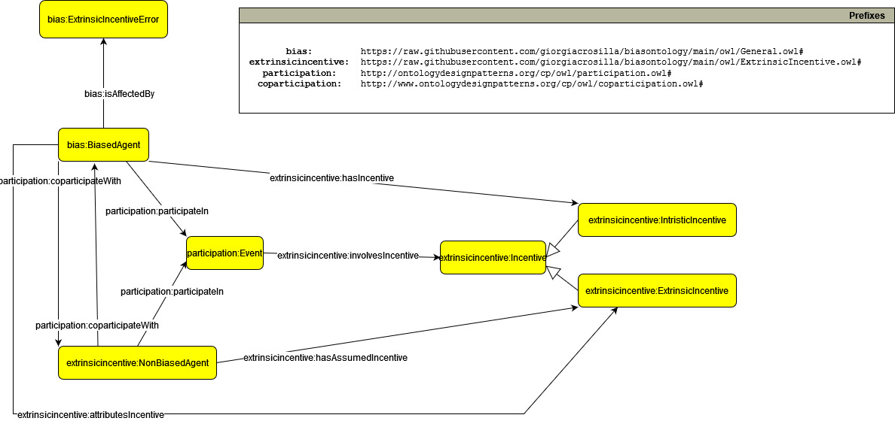

# Extrinsic incentive error



[Extrinsic Incentive Error OWL](https://raw.githubusercontent.com/giorgiacrosilla/biasontology/main/owl/ExtrinsicIncentiveError.owl)

<figure><figcaption></figcaption></figure>

### <mark style="color:red;">C</mark>ontext literature and state of the art

The extrinsic incentive bias relates to the tendency to attribute other people’s motives to extrinsic incentives, such as job security or high wages, rather than intrinsic ones, such as learning new things or building a new skill.

***

References:







***

### <mark style="color:red;">L</mark>LM

#### Give me a definition of extrinsic incentives bias 

The Extrinsic Incentives Bias is an attributional bias where people tend to attribute more to "extrinsic incentives" (such as monetary reward) than to "intrinsic incentives" (such as learning a new skill) when considering the motives of others rather than themselves. 

In simpler terms, it's the tendency to believe that others are motivated more by external rewards like money or job security, while we ourselves are driven by internal rewards like personal growth or the joy of learning. This bias can lead to misunderstandings about motivations and can impact decision-making in various contexts, such as the workplace. 

For example, in a study, MBA students predicted that Citibank customer service representatives would be most motivated by pay. However, when the representatives were asked, they ranked developing skills and abilities, accomplishing something worthwhile, and learning new things as their top motivations. 

#### Ok now give me 10 example scenarios of extrinisc incentives bias 

Sure, here are 10 example scenarios of extrinsic incentives bias: 

- Workplace Bonuses: Employees may believe that their colleagues are primarily motivated by year-end bonuses, while they themselves are driven by the satisfaction of doing a good job. 

- Academic Achievement: Parents might think that their children study hard primarily to get good grades (extrinsic motivation), while the children might feel they study to gain knowledge (intrinsic motivation). 

- Volunteering: A person might think others volunteer at a local shelter just to enhance their resume, while they themselves do it because they genuinely care about the cause. 

- Fitness Goals: Someone might assume that others go to the gym mainly to look good, while they themselves exercise for the health benefits and the feeling of well-being. 

- Artistic Pursuits: An artist might think that other artists create art to sell and make money, while they themselves create art for the love of expression and creativity. 

- Reading Books: A person might believe that others read books to show off or appear intellectual, while they themselves read for the joy of learning and escaping into different worlds. 

- Professional Development: Employees might think that their peers attend professional development courses just to impress the boss, while they themselves attend to learn new skills and improve their performance. 

- Environmental Actions: Someone might assume that others recycle or use eco-friendly products just to appear environmentally conscious, while they themselves do it because they genuinely care about the environment. 

- Healthy Eating: A person might think that others eat healthily to maintain their physical appearance, while they themselves do it for the health benefits. 

- Social Media: A user might believe that others post updates on social media for likes and comments (extrinsic rewards), while they themselves post to share their experiences and connect with friends (intrinsic rewards). 

Remember, these are hypothetical scenarios and the actual motivations can vary greatly from person to person. The key point is that extrinsic incentives bias can lead us to overestimate the role of external rewards in others' actions while underestimating the importance of intrinsic rewards. 

#### Ok now consider the scenario "2. Academic Achievement" and give me a small user story from it 

User Story: Climate Change Denial

User: Emily, a concerned citizen and environmental advocate.

Scenario:

Emily is passionate about addressing climate change and its potential impact on the planet. She engages in discussions with her friend Alex, who is skeptical about the severity of climate change. Alex argues that there's still uncertainty among scientists and points out instances where climate predictions were inaccurate.

Conversation:

Emily: "Alex, I really think we need to take climate change seriously. The scientific consensus is strong, and the consequences could be devastating."

Alex: "I'm not convinced. Scientists have been wrong before, and there's still uncertainty about the causes and the extent of climate change."

Emily: "True, science isn't always perfect, but the overwhelming majority of climate scientists agree that human activities are causing global warming. We shouldn't ignore the risks."

Alex: "I just think it's a natural cycle, and we shouldn't make drastic changes based on incomplete information."

Emily: "It's not incomplete information; it's a consensus backed by extensive research. Waiting for 100% certainty could lead to irreversible damage. We need to act now to mitigate the impacts."

Alex: "But what if we spend trillions on measures that turn out to be unnecessary? I'd rather wait until we're absolutely sure."

Emily: "That's the appeal to probability fallacy, Alex. We can't wait for absolute certainty. The potential risks are too great. It's like refusing to evacuate during a hurricane because the forecast isn't 100% certain. We should prioritize the precautionary principle and take action before it's too late."

#### We can now derive example-based-CQs; I've decided to work on another scenario, Professional Development.

1. Which event do the agents participate in?

```sparql
SELECT ?agent ?event
WHERE {
  ?event rdf:type participation:Event .
  ?agent participation:hasParticipant ?event .
}
```

2. What is the biased agent's incentive?

```sparql
SELECT ?biasedAgent ?incentive
WHERE {
  ?biasedAgent rdf:type bias:BiasedAgent .
  ?biasedAgent extrinsicincentive:hasIncentive ?incentive .
}
```

3. What incentive does the biased agent attribute to the non biased agent?

```sparql
SELECT ?biasedAgent ?nonBiasedAgent ?incentive
WHERE {
  ?biasedAgent rdf:type bias:BiasedAgent .
  ?nonBiasedAgent rdf:type extrinsicincentive:NonBiasedAgent .
  ?biasedAgent extrinsicincentive:attributesIncentive ?incentive .
  ?nonBiasedAgent extrinsicincentive:hasAssumedIncentive ?incentive .
}
```

#### Ok now if you should make an ontology of extrinsic incentives bias what classes and properties would you create? 

Following is the description of the image that was sent with the previous user message: 

Image Details- The image contains a text query asking about creating an ontology of a certain type of bias, but the specific type of bias (marked as "x bias") is not clear from the image. 

To answer your question on creating an ontology for extrinsic incentives bias: 

- Classes could include: 

    - Actors: Entities that are influenced by or are influencing through extrinsic incentives. 

    - Incentives: Different types of extrinsic rewards or penalties. 

    - Behaviors: Actions or reactions resulting from the influence of extrinsic incentives. 

    - Outcomes: The effects or results associated with the influence of extrinsic incentives. 

- Properties might involve: 

    - hasIncentive: Relating actors to specific incentives they are influenced by or offering. 

    - exhibitsBehavior: Connecting actors to behaviors influenced by extrinsic incentives. 

    - yieldsOutcome: Linking behaviors to their respective outcomes. 

I need more context to provide a detailed and accurate ontology, as it depends on the specific domain and scope where this bias is being studied or observed. 

Related Search ResultsVisual Search ResultsReverse Image ResultsOptical Character Recognition Results (<TopLeft x,y>OCR<BottomRight x,y>)## Bing 

Creating an ontology for extrinsic incentives bias would involve identifying the key concepts (classes) and relationships (properties) that capture the essence of this bias. Here's a basic example: 

Classes: 

- Actor: This class represents the individuals or groups who are subject to the bias. It could have subclasses like Self and Others to distinguish between the person holding the bias and the people they are making assumptions about. 

- Incentive: This class represents the motivations driving the actors. It could have subclasses like ExtrinsicIncentive and IntrinsicIncentive. 

- Action: This class represents the behaviors or activit ies that are influenced by the incentives. 

- Perception: This class represents the biased view of the incentives. It could have subclasses like PerceivedExtrinsicIncentive and PerceivedIntrinsicIncentive. 

Properties: 

- hasIncentive (Actor -> Incentive): This property links an actor to their incentives. 

- performsAction (Actor -> Action): This property links an actor to their actions. 

- hasPerception (Actor -> Perception): This property links an actor to their perceptions of others' incentives. 

This is a simplified example and a real ontology could be much more complex, depending on the level of detail required. It's also important to note that creating an ontology is an iterative process that involves refining the classes and properties based on new insights and feedback. 


#### ODP used:

* [Coparticipation](http://www.ontologydesignpatterns.org/cp/owl/coparticipation.owl)
* [Participation](http://www.ontologydesignpatterns.org/cp/owl/participation.owl)

