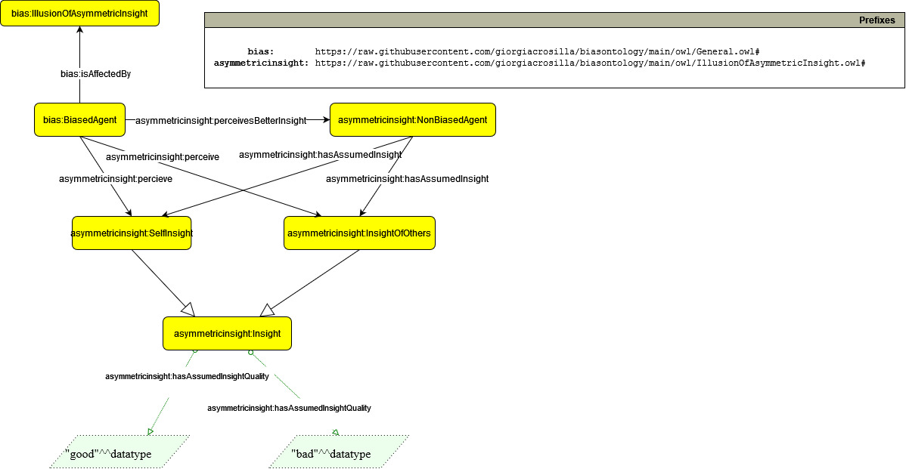

# Illusion of Asymmetric Insight



[Illusion of Asymmetric Insight Bias OWL](https://github.com/giorgiacrosilla/biasontology/blob/main/owl/IllusionOfAsymmetricInsight.owl)

<figure><figcaption></figcaption></figure>

### <mark style="color:red;">C</mark>ontext literature and state of the art

According to the definition provided on Wikipedia, the illusion of asymmetric insight is a cognitive bias whereby people perceive their knowledge of others to surpass other people's knowledge of them. This bias "has been traced to people's tendency to view their own spontaneous or off-the-cuff responses to others' questions as relatively unrevealing even though they view others' similar responses as meaningful. 

A study finds that people seem to believe that they know themselves better than their peers know themselves and that their social group knows and understands other social groups better than other social groups know them. For example: Person A knows Person A better than Person B knows Person B or Person A. This bias may be sustained by a few cognitive beliefs, including:  

The personal conviction that observed behaviors are more revealing of other people than of the self, while private thoughts and feelings are more revealing of the self. 

The more an individual perceives negative traits ascribed to someone else, the more doubt individuals express about this person's self-knowledge. But, this doubt does not exist for our own self-knowledge. (For example: if Person A believes Person B has some great character flaw, Person A will distrust Person B's self-knowledge, while sustaining that they do not hold that same flaw in self-knowledge.) 

***

References:





***

### <mark style="color:red;">L</mark>LM

#### Give me a definition of illusion of asymmetric insight  

The illusion of asymmetric insight refers to a cognitive bias wherein individuals perceive that they understand others better than others understand them, creating a perceived imbalance in insight. This phenomenon can lead people to believe that they have a deeper understanding of the thoughts, feelings, and motivations of others, while simultaneously feeling that others lack the same level of understanding about them. The illusion of asymmetric insight can contribute to misunderstandings and interpersonal conflicts, as individuals may overestimate their insight into others' perspectives while underestimating the depth of understanding others have about them. 

#### Ok now give me 10 example scenarios of illusion of asymmetric insight bias 

    Workplace Dynamics: Imagine a team member who believes they have a profound understanding of their colleagues' strengths and weaknesses, thinking they can predict their reactions in various situations. Meanwhile, they assume their coworkers lack the same level of insight into their own abilities and reactions. 

    Family Relationships: A person might feel they know their family members inside out, assuming they can accurately predict their relatives' behaviors and emotions. Simultaneously, they may believe that family members don't grasp the complexity of their own thoughts and feelings. 

    Friendship Perceptions: A friend might think they fully understand the motives and intentions of their friends, presuming an in-depth comprehension of their friends' perspectives. However, they may believe their friends don't possess the same level of insight into their own motives. 

    Romantic Relationships: In a romantic relationship, one partner might feel they have an unparalleled understanding of their significant other's emotions, while thinking their partner doesn't truly comprehend the depth of their own feelings and desires. 

    Group Discussions: Within a group setting, a person might believe they are exceptionally perceptive about others' opinions and viewpoints, assuming a deeper understanding than what others have about their own contributions to the discussion. 

    Online Interactions: In online forums or social media, an individual may think they can accurately interpret the motivations behind others' posts and comments. Simultaneously, they might assume that their online connections lack the same level of insight into the subtleties of their own online presence. 

    Cultural Misunderstandings: Someone from one cultural background may believe they have a profound understanding of the values and behaviors of individuals from another culture. At the same time, they may think that individuals from that culture lack a similar depth of understanding about their own cultural nuances. 

    Educational Settings: In a classroom setting, a student may believe they have a superior understanding of their classmates' academic capabilities and study habits, while thinking their peers don't have an accurate perception of their own intellectual strengths and weaknesses. 

    Conflict Resolution: During a disagreement or argument, one party may assume they comprehend the motives and thought processes of the other party, while feeling that the other person fails to recognize the complexities of their own perspective. 

    Political Beliefs: Individuals with strong political convictions might feel they deeply understand the motivations and rationale behind opposing viewpoints. Concurrently, they may perceive individuals with differing political beliefs as lacking insight into their own political stance. 

#### Ok now consider scenario "7. Cultural Misunderstandings" and give me a small user story from it 

User Story: Maria's Cultural Assumption 

Maria, a seasoned traveler, was excited about her upcoming business trip to Japan. Having visited multiple countries before, she felt she had developed a keen understanding of various cultures. As she landed in Tokyo, she quickly noticed subtle nuances in Japanese customs, language, and social etiquette. 

Over the course of her trip, Maria engaged with local colleagues and clients. Confident in her ability to grasp cultural intricacies, she assumed she could effortlessly navigate social interactions. She spoke in a manner she believed would resonate with her Japanese counterparts and interpreted their behaviors through her own cultural lens. 

One evening, after a business dinner, Maria was surprised to find her Japanese colleagues expressing mild discomfort. They appreciated her efforts but felt that Maria's assumptions about their culture were not entirely accurate. They wished she had asked more questions and allowed them to share their perspectives, rather than making assumptions based on her previous travel experiences. 

In this scenario, Maria experienced the illusion of asymmetric insight. While she thought she understood the Japanese culture well, her colleagues felt she lacked a true understanding of their unique context. The experience prompted Maria to reflect on the importance of actively seeking others' perspectives and avoiding assumptions based solely on her own cultural insights. 

#### We can now derive example-based-CQs from the user story.

1. Which agent believes to have a better insight than the other?

```sparql
SELECT ?biasedAgent ?nonBiasedAgent
WHERE {
  ?biasedAgent a bias:BiasedAgent ;
               asymmetricinsight:perceiveBetterInsight ?nonBiasedAgent .
}
```

2. What is the quality of the self-insight and insight of others for the BiasedAgent?

```sparql
SELECT ?selfInsightQuality ?insightOfOthersQuality
WHERE {
  ?biasedAgent a bias:BiasedAgent ;
               asymmetricinsight:perceive ?selfInsight, ?insightOfOthers .
  ?selfInsight a asymmetricinsight:SelfInsight .
  ?insightOfOthers a asymmetricinsight:InsightOfOthers .
  ?selfInsight asymmetricinsight:hasAssumedInsightQuality ?selfInsightQuality .
  ?insightOfOthers asymmetricinsight:hasAssumedInsightQuality ?insightOfOthersQuality .
}
```

3. What is the assumed self-insight and insight of others of the non-biased agent?

Scientific articles which state that in the past scientific predictions about the topic were not accurate.

```sparql
SELECT ?selfInsightQuality ?insightOfOthersQuality
WHERE {
  ?nonBiasedAgent a asymmetricinsight:NonBiasedAgent ;
                  asymmetricinsight:hasAssumedInsight ?selfInsight, ?insightOfOthers .
  ?selfInsight a asymmetricinsight:SelfInsight .
  ?insightOfOthers a asymmetricinsight:InsightOfOthers .
  ?selfInsight asymmetricinsight:hasAssumedInsightQuality ?selfInsightQuality .
  ?insightOfOthers asymmetricinsight:hasAssumedInsightQuality ?insightOfOthersQuality .
}
```

#### Ok now if you should make an ontology of illusion of asymmetric insight bias what classes and properties would you create? 

Creating an ontology for the illusion of asymmetric insight bias involves defining classes that represent different aspects of the concept and properties that describe relationships between these classes. Here's a simplified example: 

Classes: 

    Person: 

    Represents an individual who may experience or exhibit the illusion of asymmetric insight bias. 

    Insight: 

    Represents the understanding or perception that a person believes they have about themselves or others. 

    Asymmetric_Insight_Bias: 

    Represents the overarching concept of the bias where an individual perceives an imbalance in insight between themselves and others. 

    Context: 

    Represents the specific situations or domains (e.g., work, relationships, culture) where the illusion of asymmetric insight bias may manifest. 

Properties: 

    hasInsight: 

    Describes the relationship between a Person and their perceived understanding or insight. 

    perceivesAsymmetricInsight: 

    Describes the relationship between a Person and the overarching concept of Asymmetric_Insight_Bias, indicating whether the person experiences this bias. 

    occursInContext: 

    Relates the concept of Asymmetric_Insight_Bias to the specific Context in which it manifests. 

    relatesTo: 

    Represents the relationship between two Persons, indicating the perceived understanding that each person believes they have about the other. 

    influences: 

    Describes how the illusion of asymmetric insight bias may impact or be influenced by other psychological factors, such as self-awareness, empathy, or cultural sensitivity. 

This ontology provides a basic structure to capture the essential elements of the illusion of asymmetric insight bias, including the individuals involved, their perceived insights, the bias itself, the context in which it occurs, and the relationships between these components. Depending on the specific use case and requirements, additional classes and properties could be added for a more comprehensive ontology. 

