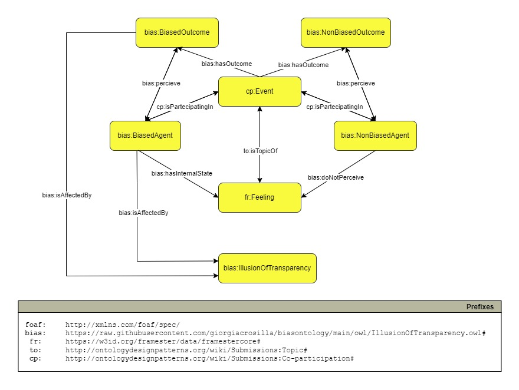

# 🤓 Illusion of transparency



[Illusion Of Transparency OWL](https://raw.githubusercontent.com/giorgiacrosilla/biasontology/main/owl/IllusionOfTransparency.owl)

<figure><figcaption></figcaption></figure>


***

References:







***

### <mark style="color:red;">L</mark>LM

#### Can you give me a definition of "Illusion of transparency" bias?

The "illusion of transparency" bias refers to the tendency of individuals to overestimate the extent to which their internal thoughts, feelings, and emotions are apparent or understandable to others. In other words, people experiencing this bias believe that their inner experiences are more visible or obvious to those around them than they actually are. 

This bias can arise in various social situations, such as during public speaking, interpersonal communication, or when individuals are under stress. People may assume that their emotions or intentions are evident to others, leading to potential miscommunications and misunderstandings. 

The illusion of transparency bias is a cognitive phenomenon that highlights the discrepancy between one's perception of self-disclosure and the actual understanding of that disclosure by others. It is important to recognize and address this bias to improve interpersonal communication and reduce the likelihood of misinterpretations in social interactions. 

#### Can you create 10 scenarios compelling with the bias?

*1.* Job Interview Nervousness: Someone may feel extremely anxious during a job interview, assuming that their nervousness is apparent to the interviewer, even though the interviewer might not notice it as much. 

*2.* Public Speaking Anxiety: A person giving a presentation might believe that their nervousness or self-doubt is evident to the audience, while the audience may not perceive these emotions as strongly. 

*3.* Romantic Confession: A person confessing their feelings to someone might believe that their romantic interest is clearly visible, whereas the other person may not pick up on these cues. 

*4.* Negotiation Stress: During a negotiation, one party might think their desperation or urgency is apparent to the other side, while the other party may not accurately interpret these internal feelings. 

*5.* Embarrassment in a Social Setting: When someone is embarrassed in a social situation, they may assume that everyone around them notices and judges their embarrassment, though others might not be as aware. 

*6.* Exam Stress: Students might feel overwhelmed during an exam, thinking that their stress is visible to their peers, even though others may be absorbed in their own concerns. 

*7.* Hidden Disagreements in a Group Discussion: A team member may believe that their disagreement with a group decision is apparent to everyone, while others may not perceive the dissenting viewpoint. 

*8.* Personal Insecurities in a Relationship: Individuals in a relationship may think that their insecurities are transparent to their partner, even if the partner is not fully aware of these internal struggles. 

*9.* Workplace Frustration: Someone dealing with frustration at work may believe their dissatisfaction is obvious to colleagues, even if others are not picking up on these emotions. 

*10.* Misinterpreted Facial Expressions: A person might believe that their facial expressions accurately convey their emotions, while others may misinterpret the expressions or not notice them at all. 


#### Now consider the scenario "Romantic Confession" and give me a short user story from it.

\*\*Scenario:\*\*

As Sarah navigates through the daily interactions with her friend, Alex, she can't help but feel a growing attraction. After weeks of contemplation, Sarah decides it's time to confess her romantic feelings. However, plagued by the illusion of transparency bias, she becomes convinced that her affection is blatantly obvious to Alex. One day, Sarah musters the courage to share her emotions. As she nervously stumbles through her confession, her heart races, and she assumes her shaky voice and flushed face are clear indicators of her romantic interest. In reality, Alex, although surprised, doesn't pick up on these subtle cues and is genuinely taken aback by Sarah's revelation. The illusion of transparency bias leads Sarah to believe that her feelings are laid bare for Alex to see, creating a mix of anxiety and anticipation. This user story explores the tension arising from the contrast between Sarah's perception of transparency and the actual level of awareness on Alex's part. 

#### We can now derive example-based-CQs from the user story.&#x20;

1. Who are the two agents involved in the event?&#x20;

- &#x20;       Biased Agent and Non Biased Agent.&#x20;
- &#x20;       Sarah and Alex.&#x20;

```sparql

SELECT ?BiasedAgent ?NonBiasedAgent
WHERE {
    ?NonBiasedAgent cp:isParticipantIn ?Event .
    ?Event a cp:Event .
    ?NonBiasedAgent illusionoftransp:doNotPercieve ?Feeling .
    ?BiasedAgent cp:isParticipantIn ?Event .
    ?BiasedAgent illusionoftransp:hasInternalState ?Feeling . 
}
```

2. What event triggers the bias and what topic is it about?&#x20;

- &#x20;       Event and Topic.&#x20;
- &#x20;       Romantic Confession and Feeling.&#x20;

```sparql
SELECT ?Topic ?Event
WHERE {
    ?Event illusionoftransp:hasOutcome ?BiasedOutcome .
    ?BiasedOutcome a illusionoftransp:BiasedOutcome .
    ?Topic to:isTopicOf ?Event .
}
```

3. Which agent is not influenced by the bias and what does he/she/it perceive as the outcome of the event?&#x20;

- &#x20;       Non Biased Agent and Non Biased Outcome.&#x20;
- &#x20;       Alex and Misunderstanding.&#x20;

```sparql
SELECT ?NonBiasedAgent ?NonBiasedOutcome
WHERE {
    ?NonBiasedAgent illusionoftransp:doNotPercieve ?Feeling .
    ?NonBiasedOutcome illusionoftransp:isPerceptionOf ?NonBiasedAgent . 
}}
```

#### If you should make an ontology based of the "Illusion of transparency" which classes and properties would you create?

#Classes: 

- Individual: 

Represents a person experiencing the illusion of transparency bias. 

InternalState: 

Represents the internal thoughts, feelings, and emotions of an individual. 

- Observer: 

Represents another person or entity observing the individual. 

Properties: 

- hasIllusionOfTransparencyBias: 

Relates an Individual to the fact that they are experiencing the illusion of transparency bias. 

- hasInternalState: 

Connects an Individual to their InternalState, representing their thoughts and emotions. 

- perceivesInternalState: 

Connects an Observer to the InternalState, representing the observer's perception of the individual's internal state. 

- hasVisibleCues: 

Indicates the visible cues that an Individual believes are apparent to others, contributing to the illusion of transparency. 

- awarenessDiscrepancy: 

Represents the difference between an Individual's perception of how visible their internal state is and the Observer's actual perception. 

#Example Instances: 

Sarah: 

Instance of Individual. 

hasIllusionOfTransparencyBias true. 

hasInternalState representing her romantic feelings. 

Alex: 

Instance of Observer. 

perceivesInternalState connected to Sarah's internal state. 

awarenessDiscrepancy indicating the difference between Sarah's perceived transparency and Alex's actual perception. 

NervousnessCue: 

Instance of hasVisibleCues. 

Represents a visible cue, like shaky voice or flushed face, contributing to the illusion of transparency. 
### Framester Frames used:

- [Feeling](https://w3id.org/framester/data/framestercore/Feeling)


### ODP used:


- [Topic](http://ontologydesignpatterns.org/wiki/Submissions:Topic)
- [Co-partecipation](http://ontologydesignpatterns.org/wiki/Submissions:Co-participation)]


