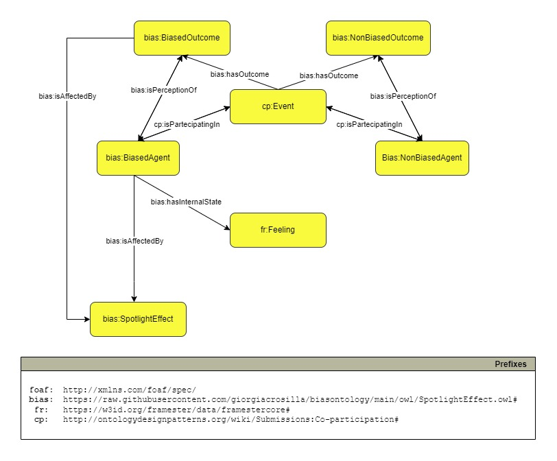

# 🤓 Spotlight effect



<figure><figcaption></figcaption></figure>


***

References:







***

### <mark style="color:red;">L</mark>LM

#### Can you give me a definition of "Spotlight effect" bias?

The "spotlight effect" bias refers to the tendency for individuals to overestimate the extent to which others notice or pay attention to their appearance, behavior, or actions in social situations. Essentially, people believe that they are the center of attention more than they actually are. This bias can lead individuals to feel self-conscious or anxious about perceived flaws or mistakes that others may not even notice. The term "spotlight effect" is often used in social psychology to describe this phenomenon. 

#### Can you create 10 scenarios compelling with the bias?

*1.* Public Speaking: Feeling like all eyes are on you and hyper-aware of any mistakes you make during a presentation, even though the audience may not notice minor slip-ups. 

*2.* Acne or Blemishes: Believing that everyone you encounter is focusing on a pimple or imperfection on your face, when in reality, most people probably don't notice or care. 

*3.* Wardrobe Malfunction: Thinking that everyone noticed when you accidentally spilled something on your shirt or your zipper was down, when many people likely didn't pay attention. 

*4.* Stumbling or Tripping: Feeling embarrassed after stumbling or tripping in public, assuming that everyone saw and judged you, when most people probably didn't even notice. 

*5.* Social Media Posts: Worrying excessively about how many likes or comments your social media posts receive, believing that everyone is closely scrutinizing your online activity. 

*6.* New Haircut or Style: Feeling self-conscious about a new haircut or style, assuming that everyone will notice and judge your appearance, when most people may not even notice the change. 

*7.* Speaking in a Group Discussion: Feeling like all participants in a group discussion are focusing intently on your contributions, even though they may be more focused on their own thoughts or contributions. 

*8.* Wearing Unusual Clothing: Thinking that everyone is staring at you when you wear something unique or unconventional, when in reality, people may glance but quickly move on. 

*9.* Public Eating: Feeling self-conscious while eating in public, assuming that others are judging your food choices or table manners, when most people are likely preoccupied with their own meals. 

*10.* Making a Mistake: Believing that everyone noticed when you made a mistake in a conversation or activity, when in reality, others may not have even noticed or may have quickly forgotten about it. 


#### Now consider the scenario "Public Eating" and give me a short user story from it.

\*\*Scenario:\*\*

As a person who experiences the spotlight effect bias, I often feel self-conscious when eating in public places such as restaurants or cafés. Recently, while dining at a busy restaurant with friends, I couldn't shake the feeling that everyone around me was scrutinizing my food choices and judging my table manners. Despite enjoying the company and conversation, I found myself feeling anxious and preoccupied with how I appeared to others. I hesitated before taking a bite, worried about drawing attention to myself or making a mess. This unease persisted throughout the meal, making it difficult to fully relax and enjoy the experience. Despite reassurances from my friends that no one was paying attention to me, I couldn't shake the belief that all eyes were on me. Reflecting on the experience afterward, I realized how much the spotlight effect bias influenced my perception of the situation, causing unnecessary stress and discomfort. 

#### We can now derive example-based-CQs from the user story.&#x20;

1. Who is the biased agent and is that the event that triggers his discomfort?&#x20;

- &#x20;      Biased Agent and Event.&#x20;
- &#x20;      Mark and Lunch at restaurant&#x20;

```sparql
SELECT ?BiasedAgent ?Event 
WHERE {
    ?BiasedAgent cp:isParticipantIn ?Event .
    ?BiasedAgent spotlighteff:percieve ?BiasedOutcome . 
    ?BiasedOutcome a spotlighteff:BiasedOutcome . 
}
```

2. What is the emotional state of the biased agent while affected by the bias?&#x20;

- &#x20;       Feeling.&#x20;
- &#x20;       Anxiety.&#x20;

```sparql
SELECT ?Feeling
WHERE {
    ?Feeling spotlighteff:isInternalStateOf ?BiasedAgent .
}
```

3. What are the two outcomes of the event?&#x20;

- &#x20;       Non Biased Outcome and Biased Outcome.&#x20;
- &#x20;       Relaxed Lunch and Unpleasant lunch.&#x20;

```sparql
SELECT ?NonBiasedOutcome ?BiasedOutcome
WHERE {
    ?NonBiasedOutcome spotlighteff:isPerceptionOf ?NonBiasedAgent .
    ?NonBiasedAgent a bias:NonBiasedAgent .
    ?BiasedOutcome spotlighteff:isPerceptionOf ?BiasedAgent .
    ?BiasedAgent a bias:BiasedAgent 
}
```

#### If you should make an ontology based of the "curse of knowledge" which classes and properties would you create?

#Classes: 

-Individual: Represents a person who experiences the spotlight effect bias. 

-Social Situation: Represents a setting or context where the spotlight effect bias may manifest, such as public speaking, social gatherings, or online interactions. 

-Perception: Represents the individual's subjective perception of being the center of attention. 

-Attention: Represents the focus or notice given by others in a social situation. 

-Anxiety: Represents the emotional response, such as stress or discomfort, associated with the spotlight effect bias. 

-Behavior: Represents actions or reactions exhibited by individuals experiencing the spotlight effect bias. 

 
#Properties: 

-experiencesBias: Relates an individual to the spotlight effect bias they experience. 

-occursIn: Relates the spotlight effect bias to the social situation where it occurs. 

-influencesPerception: Relates the spotlight effect bias to the individual's perception of being the center of attention. 

-receivesAttention: Relates the individual to the attention they perceive from others. 

-elicitsAnxiety: Relates the spotlight effect bias to the anxiety or emotional response it generates. 

-affectsBehavior: Relates the spotlight effect bias to the behavior exhibited by individuals. 


### Framester Frames used:

*
- [Feeling](https://w3id.org/framester/data/framestercore/Feeling)

* 

### ODP used:

- [Co-partecipation](http://ontologydesignpatterns.org/wiki/Submissions:Co-participation)]


